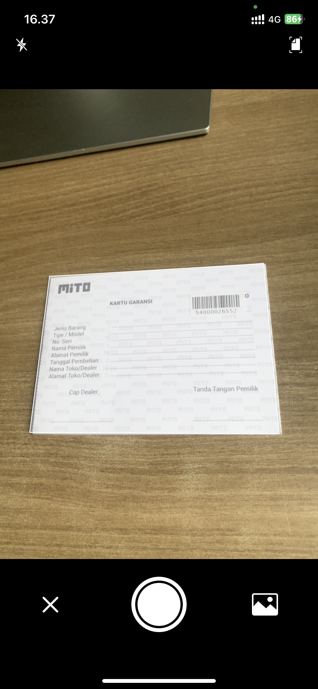
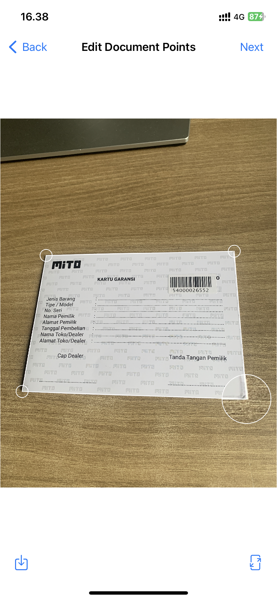
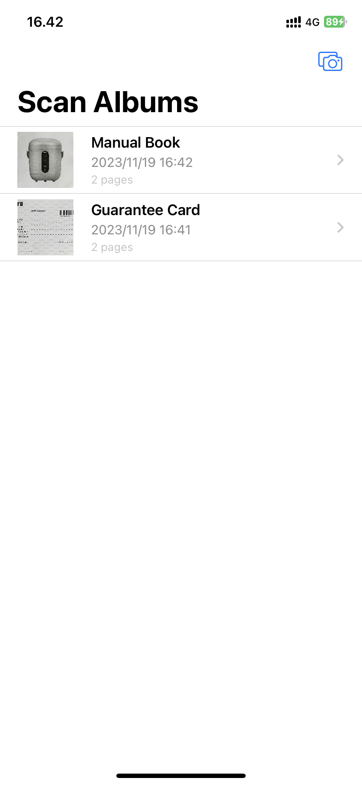
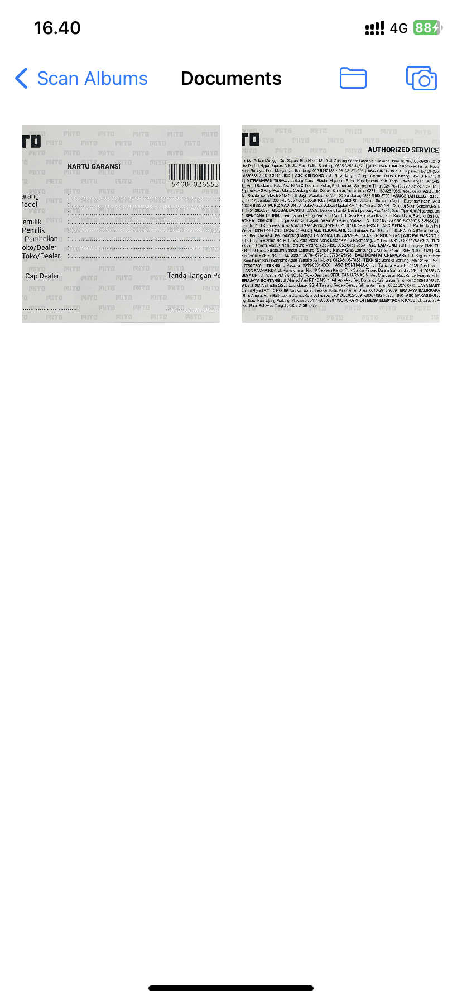

# Scandocs: Document Scanner

Scandocs is a simple and efficient document scanner app for iOS. Capture, organize, and manage your documents effortlessly. What sets Scandocs apart? It's totally free, with no ads or hidden subscriptions!

## Features

- 📷 **Easy Scanning:** Utilize your device's camera to quickly scan documents.
- 📑 **Organize Documents:** Create and manage folders to keep your scans organized.
- 🚀 **Fast and Lightweight:** Enjoy a streamlined experience with a focus on simplicity.
- 🔄 **iCloud Synced:** Your saved document are synced in iCloud. You can access it on any ios devices that use the same iCloud account.

## Get Started
1. Your system should have [`xcodegen`](https://github.com/yonaskolb/XcodeGen?tab=readme-ov-file#installing) and [`cocoapods`](https://guides.cocoapods.org/using/getting-started.html#installation) installed before running this project.
2. Clone the repository: `git clone https://github.com/rickirby/scandocs.git` or `git clone git@github.com:rickirby/scandocs.git`.
3. Run `./setup.sh` from your terminal. It should setup the project (by XcodeGen) and then setting up dependency (by CocoaPods).
2. Open `Scandocs.xcworkspace`.
3. Build and run the app on your iOS device or simulator.

## App Store

Download Scandocs on the [App Store](https://apps.apple.com/id/app/scandocs-document-scanner/id6472603812).

## Screenshots

|  |  |  |  |
|-----------------------------------------------|-----------------------------------------------|-----------------------------------------------|-----------------------------------------------|

## Keywords

Document Scanner, Scanner, Camera Scanner, Page Scan, Scan

## Contributing

We welcome contributions! Please check out our [contribution guidelines](CONTRIBUTING.md) for details.

## License

Scandocs is available under the MIT License. See the [LICENSE](LICENSE) file for more information.

---

**Note:** If you enjoy using Scandocs, consider leaving a positive review on the App Store. Your feedback is invaluable!